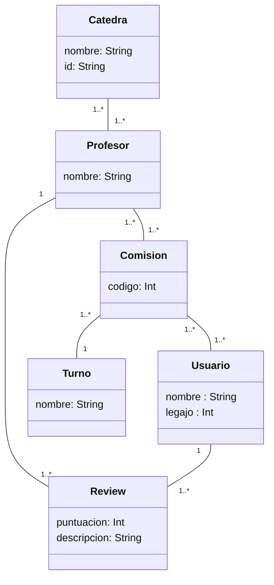

```mermaid
classDiagram

    Catedra "1..*" -- "1..*" Profesor
    Profesor "1..*" -- "1..*" Comision
    Profesor "1" -- "1..*" Review
    Usuario "1" -- "1..*" Review
    Comision "1..*" -- "1" Turno
    Comision "1..*" -- "1..*" Usuario

    class Usuario{
        nombre : String
        legajo : Int
    }

    class Review{
        puntuacion: Int
        descripcion: String
    }

    class Profesor{
        nombre: String
    }

    class Comision{
        codigo: Int
    }

    class Turno{
        nombre: String
    }

    class Catedra {
        nombre: String
        id: String      
    }
```